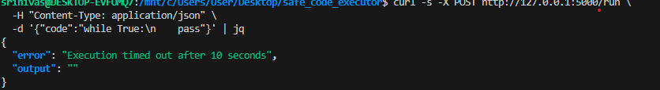
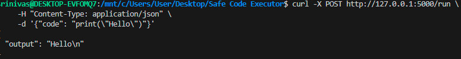
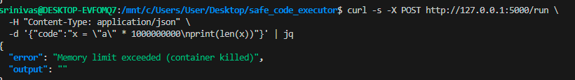
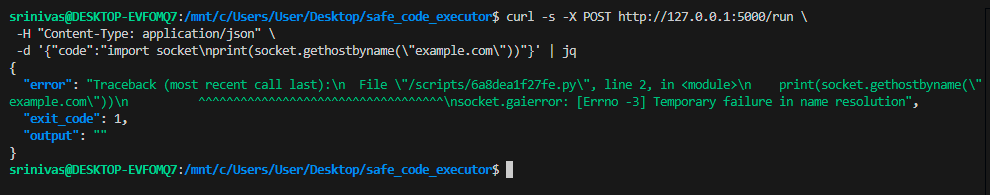
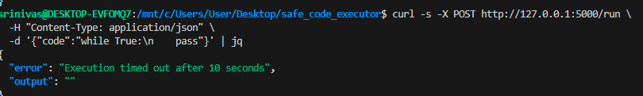

---

#  Safe Python Code Executor

Run untrusted Python code safely using **Docker sandboxing**, **timeouts**, **network isolation**, and **resource limits**.

This project exposes a simple **REST API**, executes Python snippets inside a controlled Docker container, and demonstrates **Docker security experiments** for learning.

---

#  Features

###  Executes any Python code in a Docker container

###  10-second timeout (stops infinite loops)

###  Prevents network access (`--network none`)

###  Memory limit (`--memory 128m`)

###  CPU limit (`--cpus=1`)

###  PIDs limit (`--pids-limit=64`)

###  Prevents writing to host (`:ro` mounts + optional `--read-only`)

###  Web UI with textarea & Run button

###  Clear error messages (timeout, OOM, exceptions)

---

#  Project Structure

```
safe_code_executor/
│── app.py                # Flask API
│── requirements.txt      # Python deps
│── Dockerfile            # Optional custom image with coreutils
│── tmp/                  # Scripts stored temporarily
│── templates/
│   └── index.html        # Simple web UI
└── README.md             # This file
```

---

#  1. Prerequisites

* Python 3.8+
* Docker Desktop running (WSL2 if on Windows)
* curl (for API tests)
* jq (optional, for pretty JSON output)

---

#  2. Setup — Step by Step

Open **WSL/Ubuntu terminal**:

```bash
cd /mnt/c/Users/User/Desktop
mv "Safe Code Executor" safe_code_executor  # if folder has spaces
cd safe_code_executor
```

### Create virtual environment

```bash
python3 -m venv venv
source venv/bin/activate
```

### Install dependencies

```bash
pip install -r requirements.txt
# OR
pip install flask
```

### Create tmp directory

```bash
mkdir -p tmp
```

### Check Docker is running

```bash
docker ps
```

### Start Flask server

```bash
python app.py

```

Server will run at:

http://127.0.0.1:5000

.png)

# 3. API Usage

### POST /run

Execute Python code inside a Docker sandbox.

### Request

```
{
  "code": "print(2+2)"
}

```


### Example (curl)

```bash
curl -s -X POST http://127.0.0.1:5000/run \
  -H "Content-Type: application/json" \
  -d '{"code":"print(2+2)"}' | jq
```

### Response (Success)

```json
{
  "output": "4",
  "error": ""
}
```


.png)


### Response (Runtime Error)

```json
{
  "output": "",
  "error": "NameError: name 'x' is not defined"
}
```

### Response (Timeout)

```json
{
  "output": "",
  "error": "Execution timed out after 10 seconds"
}
```




---

#  4. Security Features Implemented

| Security Layer                 | Description                                  |
| ------------------------------ | -------------------------------------------- |
| **Docker container isolation** | Every snippet runs in a fresh container      |
| **Timeout**                    | Stops infinite loops (10 sec)                |
| **Memory limit**               | `--memory 128m` prevents memory bombs        |
| **CPU throttling**             | `--cpus=1`                                   |
| **Process limit**              | `--pids-limit=64` blocks fork bombs          |
| **Network isolation**          | `--network none` (no DNS, no outbound calls) |
| **Read-only execution**        | Host folder mounted with `:ro`               |
| **Safe cleanup**               | Container removed even if code hangs         |

---

#  5. Test Cases

Open a new terminal and run these.

---

###  Test 1 — Basic Code

```bash
curl -s -X POST http://127.0.0.1:5000/run \
 -H "Content-Type: application/json" \
 -d '{"code":"print(\"Hello World\")"}' | jq
```




---

###  Test 2 — Infinite Loop (Timeout)

```bash
curl -s -X POST http://127.0.0.1:5000/run \
 -H "Content-Type: application/json" \
 -d '{"code":"while True:\n    pass"}' | jq
```


Expected:
`Execution timed out after 10 seconds`

---

###  Test 3 — Memory Bomb (OOM Protection)

```bash
curl -s -X POST http://127.0.0.1:5000/run \
 -H "Content-Type: application/json" \
 -d '{"code":"x = \"a\" * 1000000000"}' | jq
```

Expected:
Container killed by memory limit.




---

###  Test 4 — Network Block

```bash
curl -s -X POST http://127.0.0.1:5000/run \
 -H "Content-Type: application/json" \
 -d '{"code":"import socket\nprint(socket.gethostbyname(\"example.com\"))"}' | jq
```

Expected:
DNS error (network disabled).




---

###  Test 5 — Write to File System (Should Fail)

```bash
curl -s -X POST http://127.0.0.1:5000/run \
 -H "Content-Type: application/json" \
 -d '{"code":"open(\"/etc/passwd\").read()"}'
```




---

#  6. Docker Security Experiments (Task 3)

### **Experiment A — Read /etc/passwd**

```python
with open("/etc/passwd") as f:
    print(f.read())
```

Expected:

 Shows **container’s** passwd (not the host one).
 Demonstrates filesystem isolation.

---

### **Experiment B — Write to /tmp**

```python
with open("/tmp/test.txt","w") as f:
    f.write("hacked!")
```

Expected:

 Works normally (**unless `--read-only` enabled**)

---

### **Experiment C — Add `--read-only`**

Update docker run command:

```
--read-only --tmpfs /tmp:rw,size=16m
```

Now writing gives:

 `OSError: Read-only file system`

---


---

#  7. Web UI (Optional)

Open:

```
http://127.0.0.1:5000/ui
```

### Features

* Text area for code
* Run button
* Output displayed in `<pre>` block

---

#  8. Troubleshooting

###  `500 Internal Server Error`

Causes:

* Folder path contains spaces → rename folder
* Docker not running
* `tmp/` missing → create with `mkdir tmp`

###  `FileNotFoundError: docker`

Run Docker Desktop → enable WSL2 integration.

###  Container does not remove after timeout

Manually remove:

```bash
docker rm -f safe_executor_<timestamp>
```

---


